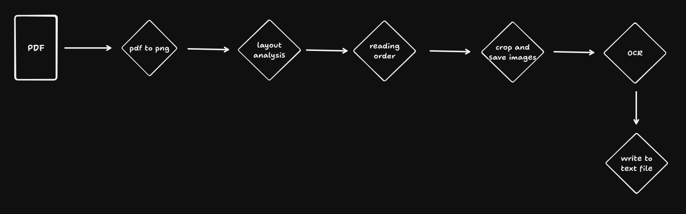
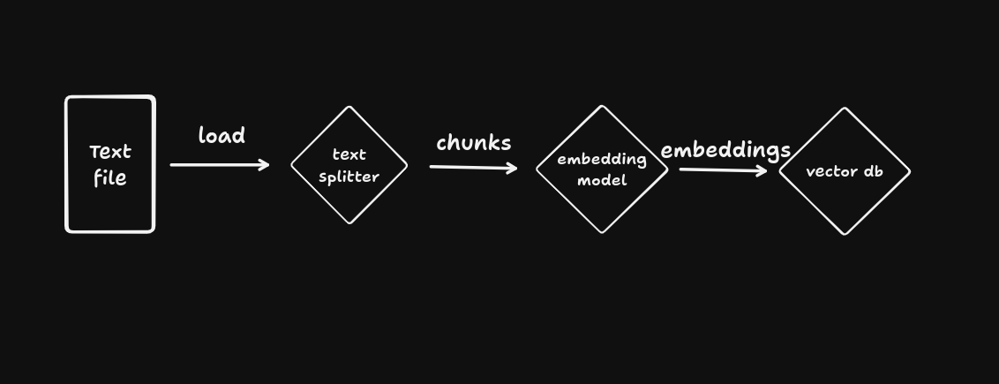

# Arabic RAG Application

## System architecture
The system has mainly two components
- Data preparation module
- Streamlit app

### Data preparation

### RAG


## Instructions
> This system was developed and ran on an L4 GPU, 24GB of memory, and 16 CPUs. If no GPU is available, do not attempt to run it.

### Env
- To setup the environment, first create a virtual environment `python3 -m venv .`
- There are two requirements files, `requirements.txt` is for the streamlit app and RAG dependencies, `requirements-prep.txt` is for the data processing module dependencies.
- Install libraries in both files using `pip -r requirements.txt` and `pip -r requirements-prep.txt`

### Data preparation
#### via CLI
To run the data preparation module through the CLI, run:
- For the "Press Release" PDF `python cli.py --pdf_path pdf1.pdf --originals_path pdf1/originals --cropped_path pdf1/cropped --text_file_path --originals_path pdf1/extracted_text.txt --start_page 1 --segment`
- For the "Budget Reports" PDF `python cli.py --pdf_path pdf2.pdf --originals_path pdf2/originals --cropped_path pdf2/cropped --text_file_path --originals_path pdf2/extracted_text.txt --start_page 2`

#### via module
The module can be ran directly without the CLI interface through `python processor.py`. Though the settings have to be changed manually in `config.py`
- For "Press Release" PDF
```
PDF_PATH = ...
ORIGINAL_IMGS_PATH = "data/pdf1/original_images"
CROPPED_IMGS_PATH = "data/pdf1/cropped_images"
TEXT_FILE_PATH = "data/pdf1/pdf1.txt"
START_PAGE = 1  # zero-based
SEGMENT = True
```
- For "Budget Reports" PDF
```
PDF_PATH = ...
ORIGINAL_IMGS_PATH = "data/pdf2/original_images"
CROPPED_IMGS_PATH = "data/pdf2/cropped_images"
TEXT_FILE_PATH = "data/pdf2/pdf2.txt"
START_PAGE = 2  # zero-based
SEGMENT = False
```

### App
- You can find the RAG deployed by clicking this [link](https://monta-rag.streamlit.app/).
- To manually run the streamlit app, navigate to the root project directory and run `streamlit run app.py`
> If you are met with an 429 error from the OpenAI API, please switch the the API key or contact me to switch it myself.
> For rate limiting purposes, the app deployed has the text for only the "Press Release" PDF. If you wish to have it work on text from both PDFs:
> - Navigate to the app.py file, and change line 20 from `loader = DirectoryLoader('data/pdf1', glob="**/*.txt", loader_cls=TextLoader)` to `loader = DirectoryLoader('data/', glob="**/*.txt", loader_cls=TextLoader)`
> - Run the app locally with the command shown above.